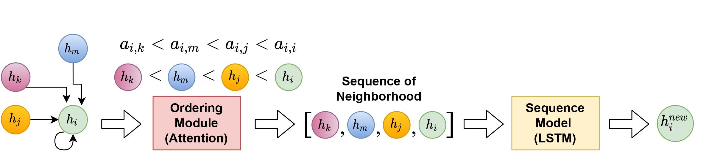

# Graph Ordering Attention Networks (GOAT)
[](#python)
[](https://opensource.org/licenses/MIT) 

This repository is the original implementation of the paper titled [Graph Ordering Attention Networks](https://arxiv.org/abs/2204.05351), accepted at AAAI2023.

 

## Abstract
Graph Neural Networks (GNNs) have been successfully used in many problems involving graph-structured data, achieving state-of-the-art performance. GNNs typically employ a message-passing scheme, in which every node aggregates information from its neighbors using a permutation invariant aggregation function. Standard well examined choices like mean or sum aggregation functions have limited capabilities, as they are not able to capture interactions among neighbors. In this work, we formalize these interactions using an information-theoretic framework that notably includes synergistic information. Driven by this definition, we introduce the Graph Ordering Attention (GOAT) layer, a novel GNN component that captures higher-level dependencies between nodes in a neighborhood. This is achieved by learning local node orderings via an attention mechanism and processing the ordered representations using a recurrent neural network aggregator. This design allows us to make use of a permutation-sensitive aggregator while maintaining the permutation-equivariance of the proposed GOAT layer. The GOAT model demonstrates its increased performance in modeling graph metrics that capture complex information, such as the betweenness centrality and the effective size of a node. In practical use-cases, its superior modeling capability is confirmed through its success in several real-world node classification benchmarks.

## Requirements
An appropriate virtual environment can be created by `conda`  using the provided environments file,
```
conda env create -f environment_droplet.yml
```
## Usage

We provide two implementations of GOAT model that you can run with the following commands
```
python train.py --goat True
python train.py --goat_imp4 True
```
## Contribution
- Michail Chatzianastasis (mixalisx97@gmail.com)
- Johannes F.Lutzeyer
- George Dasoulas
- Michalis Vazirgiannis 

